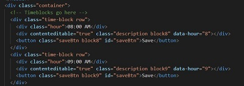
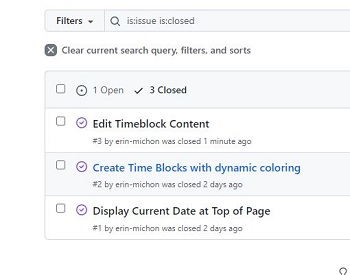
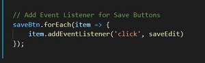

# Work Day Scheduler Starter Code

**This is a README fort the creation of a Work Day Scheduler, developed using my newly acquired skills in the use of Web API's, JavaScript, CSS and HTML.  Some of the methods and skills I used are noted below:**

* Comments were added to the script.js file as pseudocode and organization purposes.

* The Web API moment.js was utilized to obtain and compare time.

* Element blocks for the scheduler were built in HTML and each container were assigned specific classes and id's to link CSS and javaScript to the specific elements:

* I utilized GitHub Issues to help track my progress through this application:

 

* A "For Loop" was utilized to iterate through the hard-coded timeblocks and compare their time against the current time; this helped to allow the background color of the timeblocks to change based on this condition.

* An eventListener was utilized to initiate a save to localStorage:

* A "For Loop" was also utilized to iterate through the local.Storage to ensure that the users saved data is still present upon refreshing the page.

## Deployed Application

* [Work Day Scheduler](https://erin-michon.github.io/Work-Day-Scheduler/)

